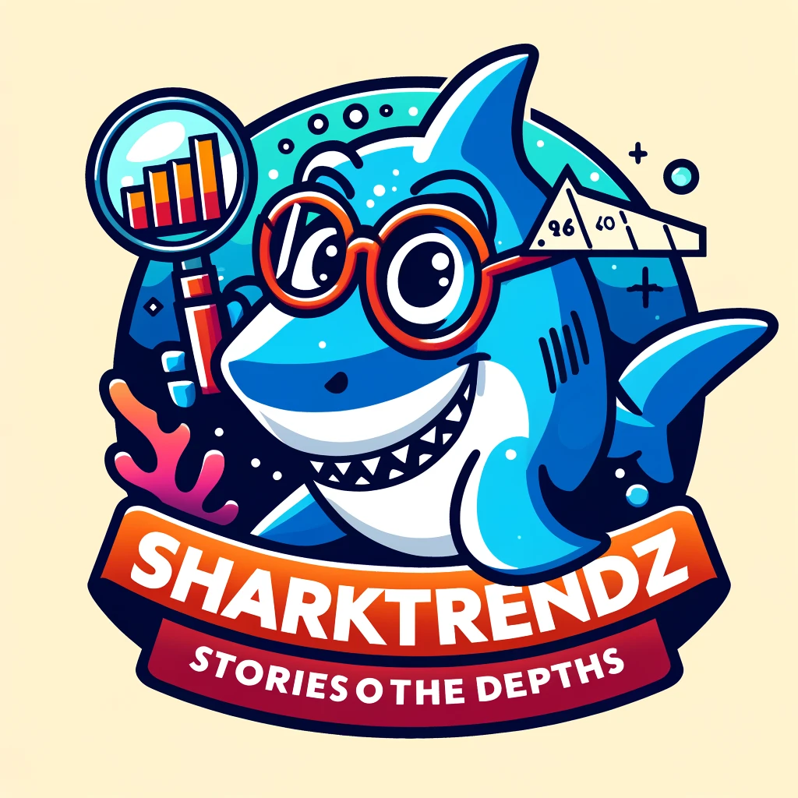
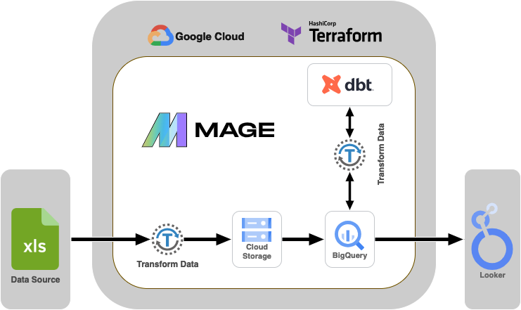
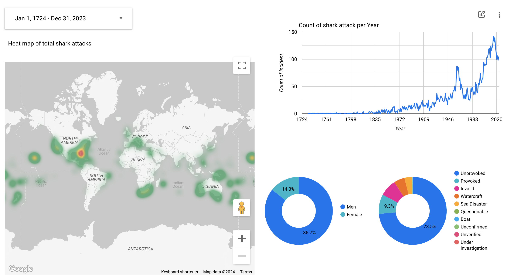
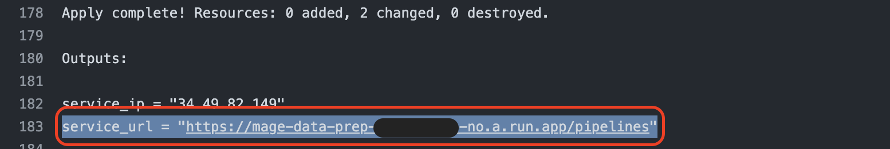
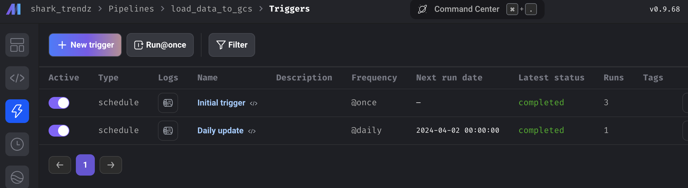

# SharkTrendz: Stories from the Depths


## Overview
As the final endeavor within the  [DEZoomcamp 2024 course](https://github.com/DataTalksClub/data-engineering-zoomcamp/tree/main), I'm profoundly thankful to [DataTalksClub](https://github.com/DataTalksClub) for orchestrating such an impactful course and graciously offering it at no cost—a gesture I find truly remarkable. 

In my project "SharkTrendz: Stories from the Depths", I conduct an analysis of a dataset related to shark attacks, extracted from the open-source website https://www.sharkattackfile.net/. This project involves processing data about events spanning over more than 300 years, with the aim of deeply analyzing and studying these incidents.

## Problem statement
My task is to analyze shark attack incidents over the last three centuries to identify overarching trends. The specific questions I aim to address include:
1. **Changes Over Time:** Is there an increase or decrease in the number of shark attacks over the period under consideration?
2. **Geographical Diversity:** Is it possible to observe geographical differences in the frequency of shark attacks worldwide?

## Technologies
In this project, we will utilize a suite of modern technologies to build a robust and scalable data pipeline. These technologies include:
- **CI/CD** - [GitHub Actions](https://github.com/features/actions): offers CI/CD by automating workflows within GitHub. We'll use it for code integration, testing, and deployment, ensuring our pipeline remains efficient and up-to-date. This tool streamlines development and deployment, enhancing collaboration and code quality.
- **Containerization** - [Docker](https://www.docker.com/): is a platform for developing, shipping, and running applications in containers. By encapsulating our application and its dependencies in a Docker container, we ensure consistency across different development and deployment environments. This simplifies the CI/CD process with GitHub Actions, as the same Docker container can be built once and deployed anywhere, reducing the complexity of deployments and testing.
- **Data lake** - [Google Cloud Storage (GCS)](https://cloud.google.com/storage): will be used as our cloud storage solution. We will store our raw data and processed data in GCS buckets, allowing us to easily access and analyze the data using other GCP tools.
- **Infrastructure as Code (IaC)** - [Terraform](https://www.terraform.io): is an open-source IaC tool that allows us to define and provision our cloud infrastructure using code. We will use Terraform to automate the deployment of our GCP resources, ensuring that our infrastructure is reproducible and scalable.
- **Workflow orchestration** - [MageAI](https://www.mage.ai): is a data engineering platform that provides tools for building and orchestrating data pipelines. We will use MageAI to manage our workflows, schedule jobs, and monitor the performance of our pipeline.
- **Data transformation** - [dbt](https://www.getdbt.com): dbt is a data transformation tool that allows us to define our transformations using SQL. We will use dbt to transform our raw data into a more structured and usable format, and to perform data quality checks.
- **Data warehouse** - [BigQuery](https://cloud.google.com/bigquery): is a fully-managed, serverless data warehouse that allows us to store and analyze large volumes of data. We will use BigQuery to store our processed data and perform data partitioning and clustering.
- **Dashboard** - [Looker Studio](https://lookerstudio.google.com): is a data visualization tool that allows us to create interactive dashboards and reports. We will use Looker Studio to visualize our data and share insights with stakeholders.

## Data pipeline



The pipeline includes the following key components:
- With the use of the MageAI orchestrator, we construct an ETL pipeline that facilitates the loading of data from an XLS file acquired from https://www.sharkattackfile.net/spreadsheets/GSAF5.xls, and subsequently transfers it to Google Cloud Storage (GCS). Afterward, the data is extracted from GCS and uploaded to the BigQuery service for further analysis.
- Next, leveraging the capabilities of dbt, data transformation is carried out, which encompasses the conversion of data types, their cleansing, and standardization.
- In the final stage, to enhance the efficiency of query processing, data in BigQuery is structured into partitions based on the year.

## Dashboard
Dashboard is available [here](https://lookerstudio.google.com/s/sI8kI_11dcs). Note that it will not be updated after April 2023.


## Deployment Instructions
1. Before starting, make sure to read the instructions in the [predefined deploy document](predefined_deploy_readme.md). 
It provides detailed, step-by-step guidelines for configuring the necessary tools and services for the deployment.
2. Clone the project's GitHub repository to your local machine:
    ```shell
    git clone https://github.com/insantr/shark-trendz.git
    cd shark-trendz
    ```
3. Copy a Terraform variable file based on the template `terraform/terraform.tfvars.tmp`:
    ```shell
    cp terraform/terraform.tfvars.tmp terraform/terraform.tfvars
    ```
4. Replace default values in `terraform/terraform.tfvars` with your values.
   - `service_account_key_file` - Full path to the JSON key file for the Google service account. (Note: if you follow instruction from [predefined deploy document](predefined_deploy_readme.md) your key file locate in  `~/.config/gcloud/shark-trendz-sa.json`)
   - `project` - The GCP project ID.
   - `region` - The GCP region where resources will be created.
5. Init Terraform
    ```shell
    terraform -chdir=terraform init -backend=false
    ```
6. Creates an Artifact Registry Repository for Docker containers:
    ```shell
    terraform -chdir=terraform apply \
        -target=google_artifact_registry_repository.my_docker_repo \
        -target=google_service_account.docker_pusher \
        -target=google_artifact_registry_repository_iam_member.docker_pusher_iam
    ```
7. Build and Push Docker images to an Artifact Registry Repository
    ```shell
    gcloud auth configure-docker <YOUR_GCP_REGION>-docker.pkg.dev
    docker build -t <YOUR_GCP_REGION>-docker.pkg.dev/shark-trendz/mage-data-prep/mageai:latest ./
    docker push <YOUR_GCP_REGION>-docker.pkg.dev/shark-trendz/mage-data-prep/mageai:latest
    ```
8. Deploy **SharkTrendz** to Google Cloud
    ```shell
    terraform -chdir=terraform apply
    ```
9. After the deployment process completes, you will see a link to MageAI in the console, Follow this link to access your MageAI instance.:

10. You will find two triggers: `Initial trigger` and `Daily update`. Wait until the `Initial trigger` status changes to `completed`.

11. All set!
A copy of the original dashboards is located [here](https://lookerstudio.google.com/s/sI8kI_11dcs) and can be used as a template to reproduce the dashboard. To adapt it to your needs, create a copy and connect your own data sources.